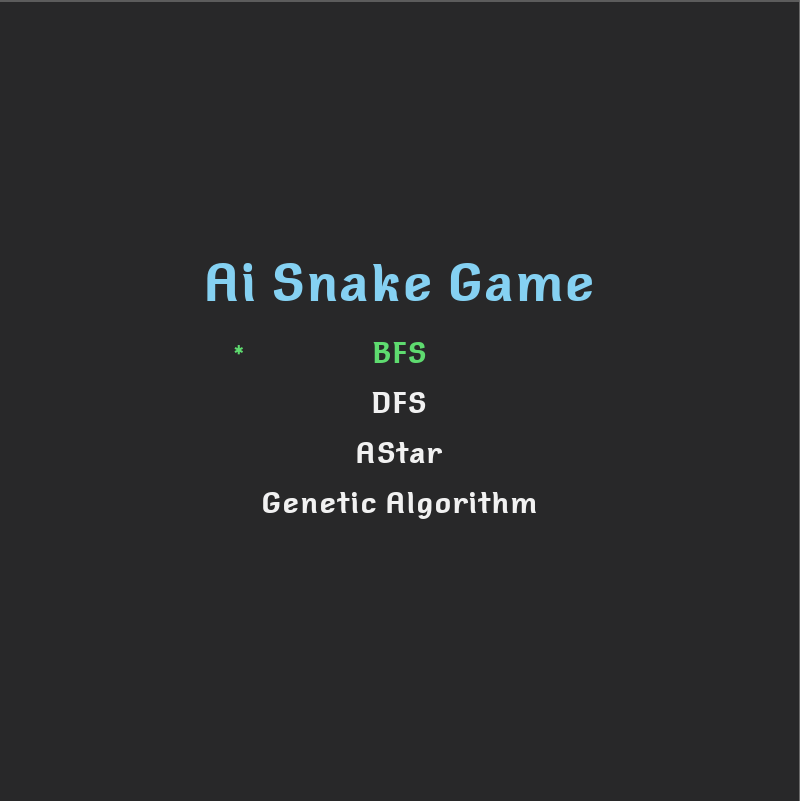
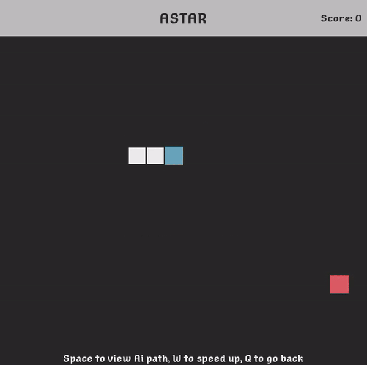
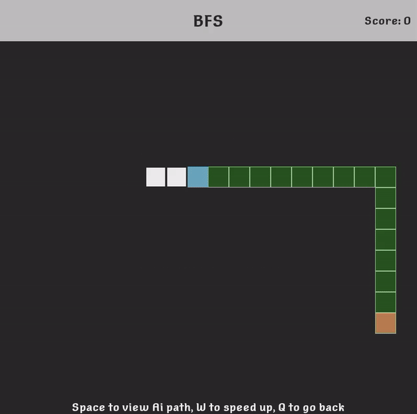
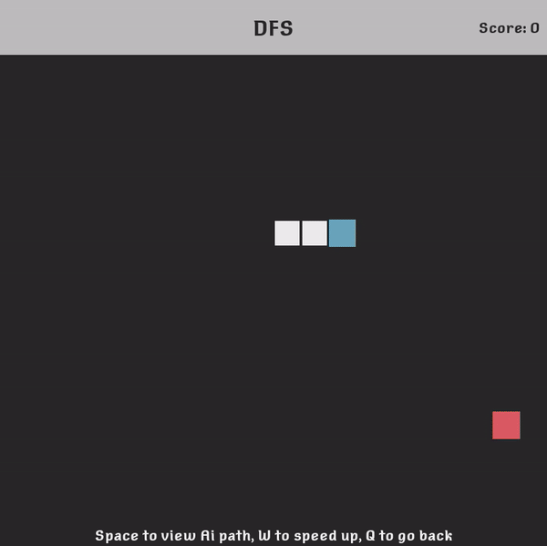
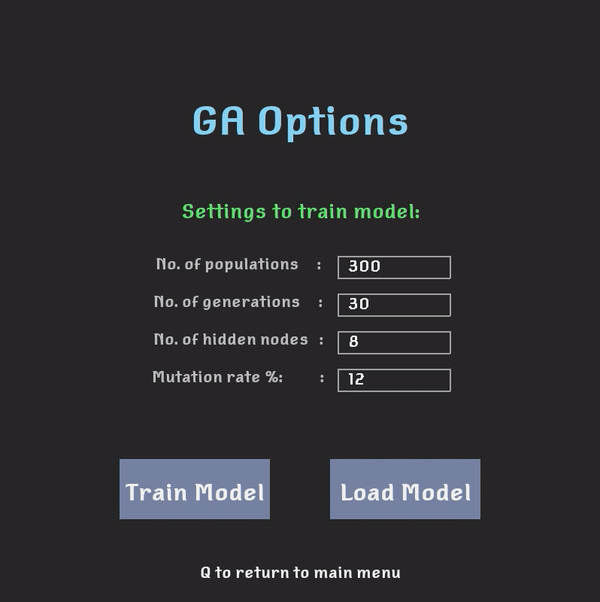

# 🐍 AI-Driven Snake Game

Welcome to the AI-Driven Snake Game! This project is a modern take on the classic Snake game, enhanced with artificial intelligence. Choose from various AI algorithms like A*, BFS, DFS, and Genetic Algorithm to see how they control the snake's movements toward its prey.

<div align="left">
<p align="left">
    
</p>
</div>

## 📜 Table of Contents

- [🐍 AI-Driven Snake Game](#-ai-driven-snake-game)
  - [📜 Table of Contents](#-table-of-contents)
  - [🌟 Overview](#-overview)
  - [🚀 Features](#-features)
  - [🛠️ Installation](#️-installation)
  - [▶️ Running the Game](#️-running-the-game)
  - [🕹️ Usage](#️-usage)
  - [⚙️ Configuration](#️-configuration)
  - [🧠 AI Algorithms](#-ai-algorithms)
  - [🤝 Contributing](#-contributing)
  - [📜 License](#-license)
  - [📬 Contact](#-contact)

## 🌟 Overview

This project leverages AI to control the snake in a grid-based environment. It provides a comparative analysis of different pathfinding and decision-making algorithms, visualizing their effectiveness in real-time.

## 🚀 Features

- **Neural Network Control**: Trained neural network to manage snake movements.
- **Preset Algorithms**: Implementations of A*, BFS, DFS, and Genetic Algorithm.
- **Menu Interface**: Graphical menu to select and switch between algorithms.
- **Path Visualization**: Real-time path highlighting to understand algorithm workings.
- **Comparative Analysis**: Compare different AI strategies in action.

## 🛠️ Installation

1. **Clone the repository**:
    ```bash
    git clone https://github.com/yourusername/snake-remake.git
    cd snake-remake
    ```

2. **Install dependencies**:
    ```bash
    pip install pygame
    ```

3. **Set up the project**:
    Run the setup script to configure the project environment.
    ```bash
    python setup.py
    ```

## ▶️ Running the Game

To start the game, run the `main.py` script:
   ```bash
   python main.py
   ```
## 🕹️ Usage

1. **Menu Navigation**: Use the keyboard or mouse to navigate through the menu.
2. **Select Algorithm**: Choose an algorithm to control the snake.
3. **Gameplay**: Observe the snake's behavior and path as it approaches its prey.
4. **Comparative Analysis**: Switch between different algorithms to compare their performance.


## ⚙️ Configuration

Modify the configuration settings in `src/config/Constants.py`:

- Grid size and dimensions
- Initial snake speed and length
- Colors (snake color, prey color, background color)
- Key bindings

## 🧠 AI Algorithms

**Preset Directory**:
- `A_STAR.py`: Implementation of the A* pathfinding algorithm.
- `BFS.py`: Implementation of the Breadth-First Search algorithm.
- `DFS.py`: Implementation of the Depth-First Search algorithm.
- `GA.py`: Implementation of the Genetic Algorithm.

**AI Directory**:
- `algorithm.py`: General AI algorithms and utility functions.
- `neural_network.py`: Neural network implementations for AI-based control.

## 🤝 Contributing

Contributions are welcome! Please open an issue or submit a pull request for any improvements or bug fixes. For major changes, please open an issue first to discuss what you would like to change.

## 📜 License

This project is licensed under the MIT License. See the [LICENSE](LICENSE) file for details.

## 📬 Contact

For any questions or suggestions, feel free to reach out:

- Email: dresta.connect@gmail.com

---

Feel free to reach out if you have any questions or need further assistance!
